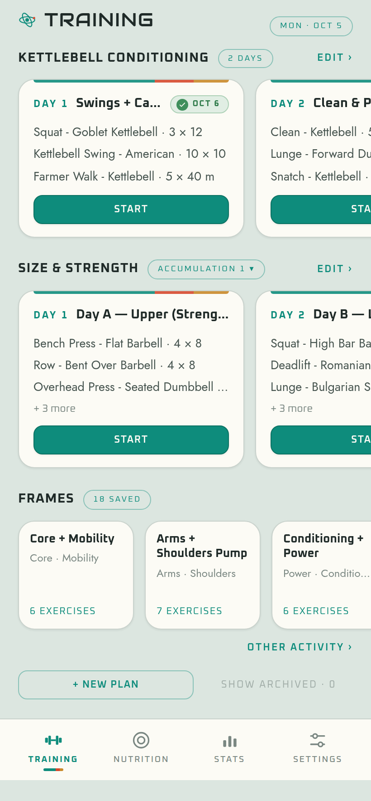
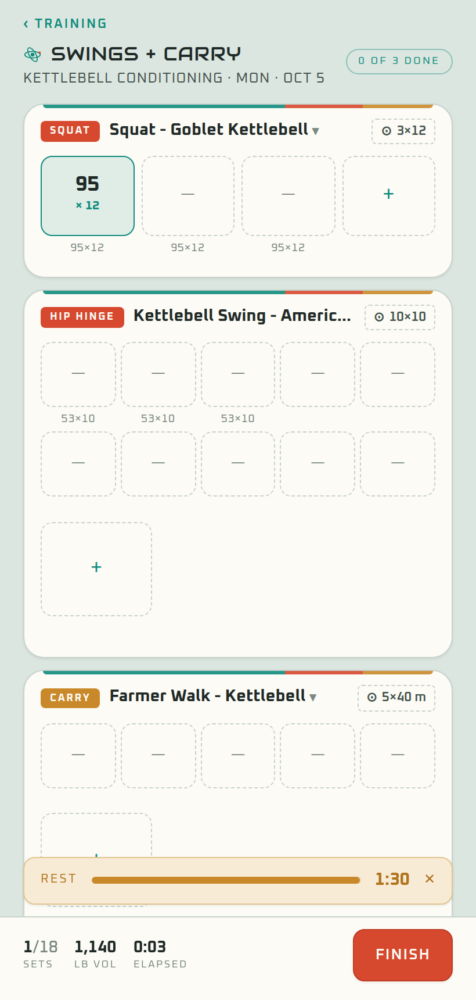
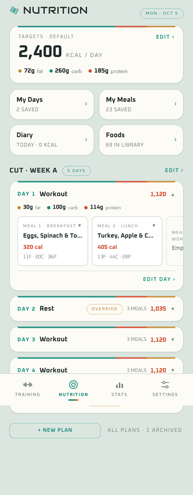
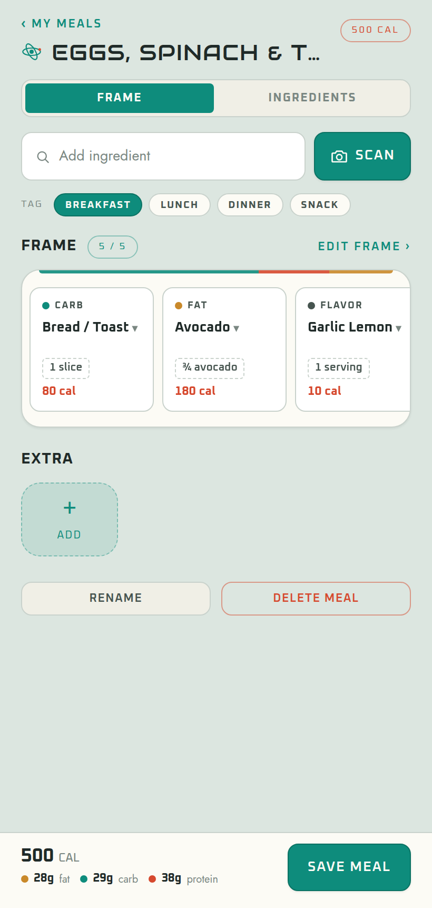
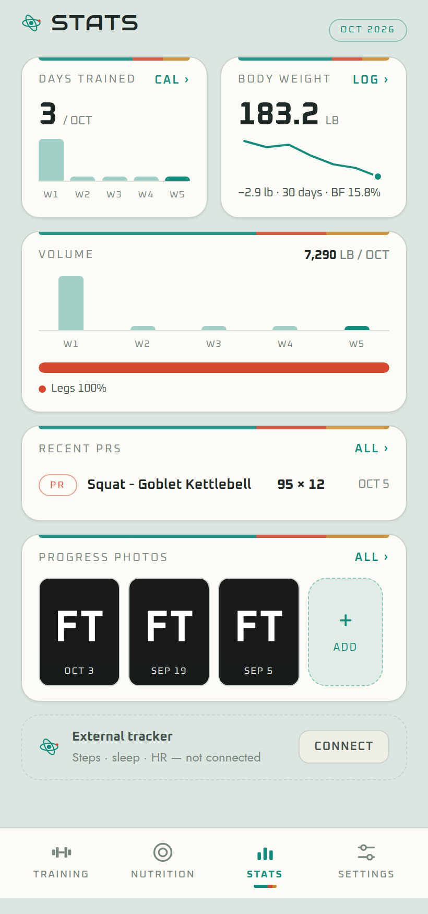
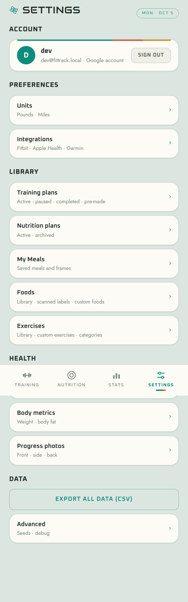

# FitTrack

Personal training + nutrition tracker for one user. Next.js 14 (App Router) + TypeScript, Prisma 7 on PostgreSQL (Railway), NextAuth (Google OAuth), Tailwind with the Atompunk `ft-*` tokens. Deployed on Vercel.

Four tabs — **Training · Nutrition · Stats · Settings**. Plans are sequences of numbered days, not calendars; workouts are logged when they happen; frames are saved workout templates; meals are built from frames (protein · carb · fat · filling · flavor) or free ingredient lists; Stats only describes what happened.

| Training | Logger | Nutrition | Meal Builder | Stats | Settings |
|---|---|---|---|---|---|
|  |  |  |  |  |  |

## Quick start

```powershell
npm install

# .env.local
#   DATABASE_URL=postgresql://...
#   GOOGLE_CLIENT_ID=...
#   GOOGLE_CLIENT_SECRET=...
#   NEXTAUTH_URL=http://localhost:3000
#   NEXTAUTH_SECRET=...
#   ANTHROPIC_API_KEY=...        # optional — label scanning parses photos only when set

npx prisma db push                                     # schema (no migration history)
npm run db:seed                                        # 367 exercises
npx tsx scripts/seed-frames.ts --user you@x.com        # 18 starter frames
npx tsx scripts/seed-meal-guide.ts --user you@x.com    # 5 meal frames · guide foods · sample meals
npx tsx scripts/add-missing-template-exercises.ts      # then:
npx tsx scripts/seed-program-templates.ts              # 8 pre-made plans (templates@fittrack.system)

npm run dev
```

## Scripts

| Script | What it does |
|--------|--------------|
| `npm run dev` / `build` / `start` / `lint` | Next dev server · `prisma generate && next build` · production server · lint |
| `npm run db:push` / `db:migrate` / `db:seed` / `db:studio` | Push schema · migrate dev · seed exercises · Prisma Studio |
| `scripts/seed-frames.ts` | Starter workout frames for a user (`--user`, idempotent) |
| `scripts/seed-meal-guide.ts` | Meal frames, foods and sample meals from the meal construction guide |
| `scripts/seed-program-templates.ts` | The 8 pre-made training plans |
| `scripts/wipe-user-programs.ts` | Dev utility — clears a user's programs |

## Documentation

- **`CLAUDE.md`** — the reference: rules, route map, data model, design system, patterns. Read it first.
- **`docs/v2-rebuild-plan.md`** — the plan the current build followed (decisions, route map, schema, API surface).
- **`docs/archive/`** — superseded specs and plans, kept for context only.
